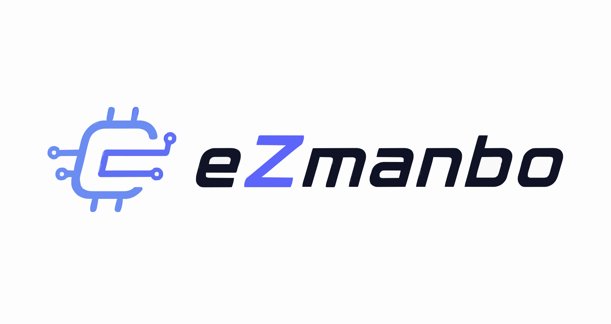

<div align="center">



# eZmanbo — 智能元器件选型与风险评估系统

[](https://github.com/Lucas-cs11/ezplm-component-risk-agent)
[](https://www.python.org/)
[](https://nextjs.org/)
[](https://fastapi.tiangolo.com/)
[]()

**AI 驱动的电子元器件智能选型与供应链风险评估系统 | eZ-PLM 集成 | 支持 DataSheet RAG**

[English](#english) | [中文](#chinese)

</div>

---

<h2 id="chinese">📖 中文文档</h2>

### 🚀 快速开始

#### 前置要求
- **Python** 3.9+ 
- **Node.js** 18+
- **macOS / Linux / WSL2**

#### 一键部署

```bash
# 1. 克隆仓库
git clone https://github.com/Lucas-cs11/ezplm-component-risk-agent.git
cd ezplm-component-risk-agent

# 2. 自动配置环境（生成 venv、安装依赖、初始化 RAG）
chmod +x setup.sh && ./setup.sh

# 3. 配置 API 密钥
# 编辑 .env 文件，填写以下内容：
# EZPLM_API_KEY=your_key_here
# OPENAI_API_KEY=your_key_here (支持 OpenAI / DeepSeek / Ollama)
vim .env

# 4. 启动后端（FastAPI）
source .venv/bin/activate
PYTHONPATH=. python3 -m uvicorn app.main:app --host 0.0.0.0 --port 8000

# 5. 启动前端（Next.js，新终端窗口）
cd frontend/web && npm run dev
# 访问 http://localhost:3000
```

> **💡 提示**：首次运行会自动下载 RAG 知识库和数据手册（~110MB）

---

### ✨ 核心特性

#### 🎯 智能选型
- **多约束条件支持**：输入电压、输出电压/电流、温度范围、应用等级等
- **即时反馈**：流式推流选型进度（搜索→评分→风险→报告）
- **自然语言交互**：支持"12V转5V 3A 车规"等混合表述

#### 🔗 eZ-PLM 深度集成
- **HMAC-SHA256 安全签名**
- **24小时关键词缓存**
- **四厂商物料库**：TI、ADI、Microchip、ST 等业界主流

#### 📊 五层复合评分（Scoring v2.0）
```
参数适配 → 供应链风险 → 成本评估 → 国产化率 → 门禁检查
  F值       R值         Cost        Domestic    Gate
```
- **10维度风险评估**（ISO 31000 / IEC 60812）
- **52厂商统一白名单**
- **车规/工业/消费三档成本基准**

#### 📚 智能 RAG 知识库
- **50器件数据手册** × 8,000+ chunks（TI/ADI/ST/Microchip）
- **29条工程设计知识**（Buck/Boost/LDO/热管理/车规/EMI）
- **本地向量化搜索**（ChromaDB + Sentence-Transformers）
- **离线容错**：无网络时启用本地知识库

#### 🛠 专业 BOM 输出
- **29列企业级 EBOM**
- **AVL/AML 映射**
- **供应链风险标记**
- **4-Sheet Excel 导出**

#### 💬 多轮会话 Agent
- **ReAct 推理架构**（Tool Calling + 链式思考）
- **会话隔离与持久化**
- **替代方案查询**、**设计建议**、**对比分析**

---

### 📦 完整功能矩阵

| 功能 | 说明 | 接口 |
|------|------|------|
| **流式选型** | 7阶段进度实时推送 | `POST /analyze/stream` |
| **意图分类** | 自动识别用户需求（选型/对话/调整） | `POST /classify` |
| **Agent 对话** | 多轮会话、知识库检索、工具调用 | `POST /agent/chat/stream` |
| **替代查询** | 找到兼容替代方案 | `POST /replacement` |
| **参数化电路图** | SVG 格式拓扑电路 | `GET /schematic/{topology}` |
| **报告导出** | Markdown / JSON / Excel | `GET /report/{type}` |
| **文件上传** | PDF/Excel 需求解析 | `POST /upload/parse` |

---

### 🛠️ 环境变量配置

编辑 `.env` 文件：

```env
# eZ-PLM API（必需）
EZPLM_API_KEY=epk_xxxxxxxxxxxxxxxxxxxxxxxxxxxxxxxxxxxxxxxx
EZPLM_BASE_URL=https://www.ezplm.cn

# LLM 服务（必需）— 支持 OpenAI / DeepSeek / Ollama 兼容接口
OPENAI_API_KEY=sk-xxxxxxxx
OPENAI_BASE_URL=https://api.openai.com/v1  # 或其他兼容服务
OPENAI_MODEL=gpt-4  # 或 deepseek-chat / ollama 等

# Web UI 配置（可选）
CORS_ORIGINS=http://localhost:3000,http://localhost:8000

# RAG 配置（可选）
DATASHEET_DIR=./docs/datasheets
CHROMA_DB_PATH=./data/chroma_db
```

---

### 📊 架构一览

```
┌─────────────────────────────────────────────────────────┐
│                   Web UI (Next.js 14)                    │
│     Components: Chat / Report / Selection / Progress     │
└────────────────────┬────────────────────────────────────┘
                     │ SSE Streaming
┌────────────────────▼────────────────────────────────────┐
│               FastAPI Backend (0.0.0.0:8000)             │
├─────────────────────────────────────────────────────────┤
│  Intent Classifier → 约束解析 → Pipeline 选型 → Agent    │
├─────────────────────────────────────────────────────────┤
│  eZ-PLM API  │  LLM 服务  │  ChromaDB RAG  │  缓存层    │
└────────────────────┬────────────────────────────────────┘
                     │
         ┌───────────┴───────────┐
         │                       │
      eZ-PLM                  本地知识库
    (器件库)               (数据手册+工程知识)
```

---

### 📚 项目结构

```
ezplm-component-risk-agent/
├── app/                          # 后端核心模块（23个）
│   ├── main.py                   # FastAPI 应用入口（13个端点）
│   ├── constraint_checker.py     # 参数提取与完整性校验
│   ├── intent_classifier.py      # 三层意图分类
│   ├── scoring.py                # Scoring v2.0 评分引擎
│   ├── ezplm_client.py           # eZ-PLM API 客户端
│   ├── react_agent.py            # ReAct 多轮会话 Agent
│   ├── rag.py                    # ChromaDB 向量检索
│   ├── datasheet_parser.py       # PDF 数据手册解析
│   └── ...                       # 其他辅助模块
│
├── frontend/
│   ├── web/                      # Next.js 14 前端项目
│   │   ├── src/components/       # React 组件
│   │   ├── src/store/            # Zustand 状态管理
│   │   └── public/               # 静态资源（LOGO、头像等）
│   └── streamlit_app.py          # 旧版 Streamlit UI（可选）
│
├── scripts/
│   ├── build_knowledge_base.py   # 构建工程知识库
│   ├── download_datasheets.py    # 下载 50 份数据手册
│   └── ingest_datasheets.py      # 灌入 ChromaDB
│
├── data/
│   ├── knowledge/                # 29条工程设计知识
│   └── chroma_db/                # 向量数据库
│
├── .env                          # API 密钥配置
├── requirements.txt              # Python 依赖
├── setup.sh                      # 一键部署脚本
└── README.md                     # 本文档
```

---

### 🐛 常见问题

**Q: 如何离线运行？**
```bash
# 确保已下载数据手册和知识库
python scripts/ingest_datasheets.py
# 然后正常启动即可，会自动使用本地 ChromaDB
```

**Q: 支持哪些 LLM？**
- ✅ OpenAI (GPT-4 / GPT-3.5)
- ✅ DeepSeek API
- ✅ Ollama 本地模型
- ✅ 其他 OpenAI 兼容接口

**Q: 如何增加自定义知识？**
```bash
# 编辑 data/knowledge/ 下的 markdown 文件
# 重新构建知识库
python scripts/build_knowledge_base.py
```

**Q: 性能如何优化？**
- 启用 Redis 缓存（修改 `semantic_cache.py`）
- 增加 Worker 进程：`uvicorn app.main:app --workers 4`
- 预加载 ChromaDB：`python -c "from app.rag import load_rag; load_rag()"`

---

### 📄 许可证

MIT License — 可自由使用、修改、商业化

---

### 🤝 贡献指南

欢迎 Pull Request！请确保：
1. 代码遵循 PEP8 规范
2. 新功能添加相应测试
3. 更新 README 说明
4. Commit 消息清晰明确

---

<h2 id="english">📖 English Documentation</h2>

### 🚀 Quick Start

#### Prerequisites
- **Python** 3.9+
- **Node.js** 18+
- **macOS / Linux / WSL2**

#### One-Command Deployment

```bash
# 1. Clone repository
git clone https://github.com/Lucas-cs11/ezplm-component-risk-agent.git
cd ezplm-component-risk-agent

# 2. Auto setup environment (venv + dependencies + RAG)
chmod +x setup.sh && ./setup.sh

# 3. Configure API keys
# Edit .env file with:
# EZPLM_API_KEY=your_key_here
# OPENAI_API_KEY=your_key_here (OpenAI / DeepSeek / Ollama compatible)
vim .env

# 4. Start backend (FastAPI)
source .venv/bin/activate
PYTHONPATH=. python3 -m uvicorn app.main:app --host 0.0.0.0 --port 8000

# 5. Start frontend (Next.js, in new terminal)
cd frontend/web && npm run dev
# Visit http://localhost:3000
```

> **💡 Tip**: First run will auto-download RAG knowledge base (~110MB)

---

### ✨ Key Features

#### 🎯 Intelligent Component Selection
- **Multi-constraint Support**: Input voltage, output voltage/current, temperature range, application grade, etc.
- **Real-time Feedback**: Streaming selection progress (search → scoring → risk → report)
- **Natural Language Interface**: Support mixed expressions like "12V to 5V 3A automotive-grade"

#### 🔗 Deep eZ-PLM Integration
- **HMAC-SHA256 Security**
- **24-hour Keyword Cache**
- **Multi-vendor Database**: TI, ADI, Microchip, ST and more

#### 📊 Five-Layer Composite Scoring (v2.0)
```
Parameter Fit → Supply Chain Risk → Cost → Domestic Rate → Gate Check
    F-score       R-score          Cost      Domestic       Gate
```
- **10-dimensional Risk Assessment** (ISO 31000 / IEC 60812)
- **52 Trusted Vendors Whitelist**
- **Three-tier Cost Benchmarks** (Automotive / Industrial / Commercial)

#### 📚 Intelligent RAG Knowledge Base
- **50 Device Datasheets** × 8,000+ chunks (TI/ADI/ST/Microchip)
- **29 Engineering Design Patterns** (Buck/Boost/LDO/Thermal/Automotive/EMI)
- **Local Vector Search** (ChromaDB + Sentence-Transformers)
- **Offline Fallback**: Works without internet using local knowledge

#### 🛠 Professional BOM Output
- **29-column Enterprise EBOM**
- **AVL/AML Mapping**
- **Supply Chain Risk Flags**
- **4-Sheet Excel Export**

#### 💬 Multi-turn Conversational Agent
- **ReAct Reasoning** (Tool Calling + Chain-of-Thought)
- **Session Isolation & Persistence**
- **Alternative Finding**, **Design Suggestions**, **Comparative Analysis**

---

### 📦 Complete Feature Matrix

| Feature | Description | API Endpoint |
|---------|-------------|--------------|
| **Streaming Selection** | 7-stage real-time progress | `POST /analyze/stream` |
| **Intent Classification** | Auto-identify user intent | `POST /classify` |
| **Agent Chat** | Multi-turn conversation + tools | `POST /agent/chat/stream` |
| **Alternative Finder** | Find compatible replacements | `POST /replacement` |
| **Parametric Schematic** | SVG circuit topology | `GET /schematic/{topology}` |
| **Report Export** | Markdown / JSON / Excel | `GET /report/{type}` |
| **File Parsing** | PDF/Excel requirement extraction | `POST /upload/parse` |

---

### 🛠️ Environment Configuration

Edit `.env` file:

```env
# eZ-PLM API (Required)
EZPLM_API_KEY=epk_xxxxxxxxxxxxxxxxxxxxxxxxxxxxxxxxxxxxxxxx
EZPLM_BASE_URL=https://www.ezplm.cn

# LLM Service (Required) — Supports OpenAI / DeepSeek / Ollama
OPENAI_API_KEY=sk-xxxxxxxx
OPENAI_BASE_URL=https://api.openai.com/v1  # or other compatible service
OPENAI_MODEL=gpt-4  # or deepseek-chat / ollama etc.

# Web UI Config (Optional)
CORS_ORIGINS=http://localhost:3000,http://localhost:8000

# RAG Config (Optional)
DATASHEET_DIR=./docs/datasheets
CHROMA_DB_PATH=./data/chroma_db
```

---

### 📊 Architecture Overview

```
┌─────────────────────────────────────────────────────────┐
│                   Web UI (Next.js 14)                    │
│     Components: Chat / Report / Selection / Progress     │
└────────────────────┬────────────────────────────────────┘
                     │ SSE Streaming
┌────────────────────▼────────────────────────────────────┐
│               FastAPI Backend (0.0.0.0:8000)             │
├─────────────────────────────────────────────────────────┤
│  Intent Classifier → Constraint Parse → Pipeline → Agent │
├─────────────────────────────────────────────────────────┤
│  eZ-PLM API  │  LLM Service  │  ChromaDB RAG  │  Caching │
└────────────────────┬────────────────────────────────────┘
                     │
         ┌───────────┴───────────┐
         │                       │
      eZ-PLM                  Local Knowledge Base
    (Component DB)         (Datasheets + Engineering Docs)
```

---

### 📚 Project Structure

```
ezplm-component-risk-agent/
├── app/                          # Backend core (23 modules)
│   ├── main.py                   # FastAPI entry (13 endpoints)
│   ├── constraint_checker.py     # Parameter extraction & validation
│   ├── intent_classifier.py      # Three-layer intent classification
│   ├── scoring.py                # Scoring v2.0 engine
│   ├── ezplm_client.py           # eZ-PLM API client
│   ├── react_agent.py            # ReAct multi-turn agent
│   ├── rag.py                    # ChromaDB vector search
│   ├── datasheet_parser.py       # PDF datasheet parsing
│   └── ...                       # Other modules
│
├── frontend/
│   ├── web/                      # Next.js 14 frontend
│   │   ├── src/components/       # React components
│   │   ├── src/store/            # Zustand state mgmt
│   │   └── public/               # Static assets (logo, avatar)
│   └── streamlit_app.py          # Legacy Streamlit UI (optional)
│
├── scripts/
│   ├── build_knowledge_base.py   # Build engineering KB
│   ├── download_datasheets.py    # Download 50 datasheets
│   └── ingest_datasheets.py      # Ingest to ChromaDB
│
├── data/
│   ├── knowledge/                # 29 engineering patterns
│   └── chroma_db/                # Vector database
│
├── .env                          # API key configuration
├── requirements.txt              # Python dependencies
├── setup.sh                      # One-click deployment
└── README.md                     # This documentation
```

---

### 🐛 FAQ

**Q: How to run offline?**
```bash
# Ensure datasheets and knowledge base are downloaded
python scripts/ingest_datasheets.py
# Then start normally, will use local ChromaDB
```

**Q: Which LLMs are supported?**
- ✅ OpenAI (GPT-4 / GPT-3.5)
- ✅ DeepSeek API
- ✅ Ollama local models
- ✅ Other OpenAI-compatible endpoints

**Q: How to add custom knowledge?**
```bash
# Edit markdown files in data/knowledge/
# Rebuild knowledge base
python scripts/build_knowledge_base.py
```

**Q: Performance optimization?**
- Enable Redis cache (modify `semantic_cache.py`)
- Add workers: `uvicorn app.main:app --workers 4`
- Preload ChromaDB: `python -c "from app.rag import load_rag; load_rag()"`

---

### 📄 License

MIT License — Free to use, modify, and commercialize

---

### 🤝 Contributing

Pull Requests welcome! Please ensure:
1. Code follows PEP8 style
2. New features include tests
3. README updated accordingly
4. Clear commit messages

---

<div align="center">

Made with ❤️ for the EDA & Electronics Community

[GitHub](https://github.com/Lucas-cs11/ezplm-component-risk-agent) · [Issues](https://github.com/Lucas-cs11/ezplm-component-risk-agent/issues) · [Discussions](https://github.com/Lucas-cs11/ezplm-component-risk-agent/discussions)

</div>
