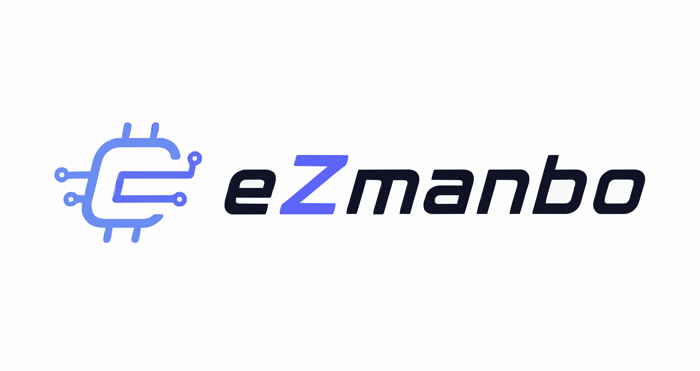
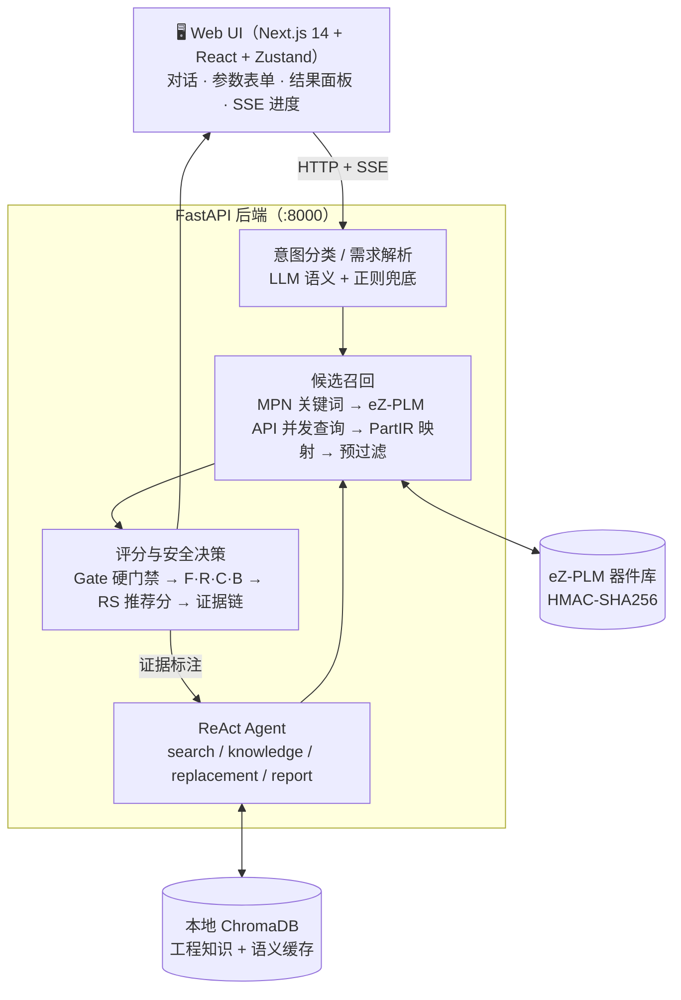

<div align="center">



# eZmanbo

**面向 eZ-PLM 的电子元器件智能选型与风险评估 Agent 系统**

把硬件工程师的自然语言选型需求，转化为**可验证、可审计、可导出**的器件推荐与供应链风险报告。

[](https://www.python.org/)
[](https://fastapi.tiangolo.com/)
[](https://nextjs.org/)
[](https://www.langchain.com/)
[](https://www.trychroma.com/)
[](LICENSE)

[功能特性](#功能特性) · [效果亮点](#效果亮点) · [快速开始](#快速开始) · [架构](#架构) · [项目结构](#项目结构) · [API 一览](#api-一览) · [文档](#文档)

</div>

---

## 这是什么

电子元器件选型是硬件研发中最耗时、出错代价最高的环节之一——单颗器件选型（参数比对、规格核验、供货确认）往往需要 **2–4 小时**，复杂项目完整 BOM 选型可达 **40 小时以上**。

直接把需求丢给通用大模型看似省事，但 LLM 训练数据中的器件型号大量**不可验证、已停产或已断供**，且缺少对认证等级、温度覆盖、生命周期等**工程安全条件**的系统性检查。

**eZmanbo 的核心思路：数据接地 + 硬约束门禁 + 证据可溯。**

> LLM 只负责「理解需求、组织语言」，**不负责生成任何器件事实**；候选器件一律来自 eZ-PLM 真实数据库的结构化查询结果，并经过硬门禁核查与证据标注后才进入推荐列表。

- 🎯 把「12V 转 5V / 3A / 车规」这类自然语言需求，解析成结构化约束并完成选型
- 🛡️ 每一颗推荐器件都通过电气边界、温度覆盖、认证、生命周期等**硬门禁**核查
- 📎 每条推荐参数都标注来源（平台数据 / 数据手册 / 规则推断）与置信度
- 💬 多轮对话中服务端**持久化累积约束**，不用每轮重复交代需求
- 📦 输出结构化报告、企业级 BOM、决策包与参数化电路图

---

## 功能特性

### 自然语言选型
- 意图分类（选型 / 追问 / 参数调整 / 闲聊）+ 需求解析，**LLM 语义理解 + 正则规则双层兜底**
- 支持隐含语义（「给 STM32 供电」→ 3.3V）、单位换算、等级→温区映射（工业级 / 车规级）
- P0/P1/P2 约束分级：必填字段缺失时主动追问，每轮最多追问 2 个缺失参数

### 候选召回（数据接地）
- 依据类别 + 拓扑自动生成多厂商 **MPN 前缀关键词**，`asyncio.Semaphore` 并发查询 eZ-PLM API
- 异构字段统一映射到内部 **PartIR** 数据模型；HMAC-SHA256 签名 + 令牌桶限速 + 双层 LRU 缓存
- 混合检索：向量 + BM25 + **RRF 融合**，兼顾语义知识与精确型号查询

### 评分与安全决策
- **Gate 硬门禁（一票否决）**：电气边界 / 温度覆盖 / 车规认证 / 生命周期 / 数据完整性逐条核查，任一不满足即排除
- 推荐分 `RS = gate × 100 · F^α · (1-R/100)^β · C^γ · B^δ`（乘性聚合 + 场景化权重 + 保守缺失惩罚）
- 证据链来源标注 E1/E2/E3 + 置信度 + 人工复核标记

### 多轮会话 Agent
- 基于 LangChain ReAct 的选型助理，四类工具：器件搜索、设计知识检索、替代料查找、完整报告生成
- 工具空结果时**诚实降级**而非编造型号；回复中的疑似型号会被自动扫描、追加数据验证提示
- 会话历史 DB 持久化 + MicroCompact 上下文压缩 + Token 超限降级

### 输出与集成
- SSE 流式推送选型各阶段进度；报告 / 风险 / BOM / 决策包导出
- 认证登录、会话管理、参数化电路图（Buck / Boost / LDO）

---

## 效果亮点

> 以下为项目内审计口径的实测结果，详细实验设计见 [`docs/experiments_design.md`](docs/experiments_design.md)，技术报告见 [`docs/paper_main.md`](docs/paper_main.md)。

| 指标 | 结果 | 说明 |
|---|---|---|
| **MPN 可验证率** | eZmanbo **100%** vs 通用 LLM 基线 **≈8%** | 输出型号均可回溯到 eZ-PLM 真实数据库 |
| **安全门禁漏放率** | **0%**（5 条车规需求 × 75 候选审计，精确率 / 召回率均 100%） | 认证、温度、生命周期不合规器件全部被拦截 |
| **LLM 直接生成事实参数占比** | **0%** | 证据来源 64.1% 平台数据、10.3% 命名规则推断、2.6% 数据手册，符合「事实与生成分离」设计 |

---

## 快速开始

### 前置要求

- **Python** 3.14（本项目 CI 与生产环境的实测版本；更低版本未经验证）
- **Node.js** 18+
- macOS / Linux / WSL2

### 一键部署

```bash
# 1. 克隆并进入
git clone https://github.com/Lucas-cs11/ezmanbo-agent.git
cd ezmanbo-agent

# 2. 安装 Python 依赖并初始化工程知识库
chmod +x setup.sh && ./setup.sh

# 3. 配置密钥（.env）
#    至少填写 EZPLM_API_KEY 与一个 LLM API Key
vim .env

# 4. 启动后端（SSE / HTTP）
source .venv/bin/activate
PYTHONPATH=. python3 -m uvicorn app.main:app --host 0.0.0.0 --port 8000

# 5. 启动前端（新终端）
cd frontend/web && npm install && npm run dev
# 打开 http://localhost:3000
```

### 环境变量（`.env`）

```env
# eZ-PLM
EZPLM_API_KEY=your_ezplm_api_key_here
EZPLM_BASE_URL=https://www.ezplm.cn

# LLM（OpenAI 兼容接口，支持 Anthropic / OpenAI / DeepSeek / Ollama 等）
OPENAI_API_KEY=your_openai_compatible_api_key_here
OPENAI_BASE_URL=
ANTHROPIC_API_KEY=
ANTHROPIC_BASE_URL=

# 前端跨域（可选）
CORS_ORIGINS=http://localhost:3000,http://localhost:8000
```

### 自定义知识库

```bash
# 编辑 data/knowledge/engineering_knowledge.json 后重建向量库
PYTHONPATH=. python3 scripts/build_knowledge_base.py
```

---

## 架构


```mermaid
flowchart TD
    UI["🖥️ Web UI（Next.js 14 + React + Zustand）<br/>对话 · 参数表单 · 结果面板 · SSE 进度"]
    subgraph API["FastAPI 后端（:8000）"]
        R1["意图分类 / 需求解析<br/>LLM 语义 + 正则兜底"]
        R2["候选召回<br/>MPN 关键词 → eZ-PLM API 并发查询 → PartIR 映射 → 预过滤"]
        R3["评分与安全决策<br/>Gate 硬门禁 → F·R·C·B → RS 推荐分 → 证据链"]
        R4["ReAct Agent<br/>search / knowledge / replacement / report"]
    end
    UI -->|HTTP + SSE| R1
    R1 --> R2 --> R3 --> UI
    R4 --> R2
    R3 -->|证据标注| R4
    EZ[("eZ-PLM 器件库<br/>HMAC-SHA256")]
    KB[("本地 ChromaDB<br/>工程知识 + 语义缓存")]
    R2 <--> EZ
    R4 <--> KB
```

两条主路径：
1. **确定性选型流水线**（`/analyze`、`/chat/stream`）：解析 → 召回 → 评分 → 门禁 → 证据 → 报告，适合标准选型，快且稳；
2. **多轮 ReAct Agent**（`/agent/chat/stream`）：交互式澄清、替代料、设计追问，适合探索式选型。

> 更完整的四层架构、状态机与评分流程说明见 [`docs/architecture_diagrams.md`](docs/architecture_diagrams.md)。

---

## 项目结构

```
ezmanbo-agent/
├── app/                        # FastAPI 后端
│   ├── main.py                 # 路由入口（HTTP + SSE）
│   ├── agent_orchestrator.py   # 确定性选型流水线
│   ├── react_agent.py          # ReAct 多轮会话 Agent（LangChain）
│   ├── agent_tools.py          # Agent 工具（search / knowledge / replacement / report）
│   ├── intent_classifier.py    # 意图分类
│   ├── requirement_parser.py   # 需求解析（Function Calling + 正则兜底）
│   ├── constraint_checker.py   # 约束完整性 / P0-P2 / 多轮累积状态机
│   ├── ezplm_client.py         # eZ-PLM API 客户端（HMAC + 缓存 + 限速）
│   ├── scoring.py              # Gate 硬门禁 + 多维评分（F/R/C/B → RS）
│   ├── evidence.py             # 证据链与来源标注（E1/E2/E3）
│   ├── rag.py                  # 工程知识库向量检索
│   ├── hybrid_retrieval.py     # BM25 + 向量 + RRF 混合检索
│   ├── datasheet_parser.py     # 数据手册 PDF 解析与分块
│   ├── semantic_cache.py       # 语义缓存（相似需求复用）
│   ├── report_generator.py     # 风险报告生成
│   ├── output_*.py             # BOM / 决策包 / 报告导出
│   ├── schematic_generator.py  # 参数化电路图（schemdraw）
│   ├── auth.py / database.py / models_db.py   # 认证与会话持久化
│   └── routers/                # auth / admin 路由
├── frontend/web/               # Next.js 14 前端（src/components · src/store · public）
├── scripts/                    # 知识库构建、数据导入、评估脚本
├── tests/                      # pytest + 端到端评测
│   ├── cases/                  # 选型评测用例（dc_dc / ldo）
│   └── eval_runner.py          # 评测运行器（生成 md + json 报告）
├── docs/                       # 技术文档
│   ├── architecture_diagrams.md
│   ├── experiments_design.md
│   └── paper_main.md
├── data/                       # 知识库源数据与 mock 器件库
├── .env.example
├── requirements.txt
├── setup.sh
└── README.md
```

---

## API 一览

| 方法 | 路径 | 说明 |
|---|---|---|
| POST | `/analyze` | 完整结构化选型分析 |
| POST | `/analyze/stream` | 选型分析（SSE 流式） |
| POST | `/chat/stream` | 对话式选型（含约束累积，SSE） |
| POST | `/classify` | 意图分类 |
| POST | `/agent/chat` | 多轮 ReAct Agent 对话 |
| POST | `/agent/chat/stream` | Agent 对话（SSE 流式） |
| POST | `/replacement` | 替代料查询 |
| POST | `/select-part` | 会话内确认选中器件 |
| GET | `/report/{type}` | 获取风险 / BOM / 拓扑报告 |
| POST | `/export/bom` | 导出 BOM |
| POST | `/export/decision-package` | 导出选型决策包 |
| GET | `/schematic/{topology}` | 参数化电路图（SVG） |
| POST | `/upload/parse` | 解析 PDF / Excel 需求文件 |
| POST | `/bom/validate` | BOM 校验 |
| POST | `/recalculate` | 重新计算评分 |
| POST | `/workflow/generate` | 生成选型工作流 |
| POST | `/api/models/switch` | 运行时切换模型 |
| POST | `/auth/login` / `/auth/guest` | 认证（`routers/`）。`/auth/register` 已永久关闭，账号由管理员创建 |

---

## 测试

```bash
PYTHONPATH=. python -m pytest tests/ -x -q          # 回归测试
PYTHONPATH=. python -m tests.eval_runner            # 端到端选型评测（输出 docs/eval_results/）
```

## 文档

- [`docs/architecture_diagrams.md`](docs/architecture_diagrams.md) — 四层架构 / 状态机 / 评分流程说明
- [`docs/experiments_design.md`](docs/experiments_design.md) — 实验设计与评测指标
- [`docs/paper_main.md`](docs/paper_main.md) — 系统技术报告（含设计动机与相关工作）

## Roadmap

- [x] 需求解析 / 意图分类（LLM + 规则双层兜底）
- [x] 数据接地候选召回 + PartIR 规范化
- [x] 多维评分 + Gate 硬门禁 + 证据链标注
- [x] 多轮约束累积 + ReAct Agent + 语义缓存
- [x] 报告 / BOM / 决策包导出 + 参数化电路图
- [ ] 更多器件品类（运放、接口、MCU）与参考设计覆盖
- [ ] 供应链实时数据接入（交期 / 库存 / 价格）
- [ ] 边界场景约束提取优化与大规模评测集
- [ ] Docker 化部署与多实例会话亲和

## License

[MIT](LICENSE)
