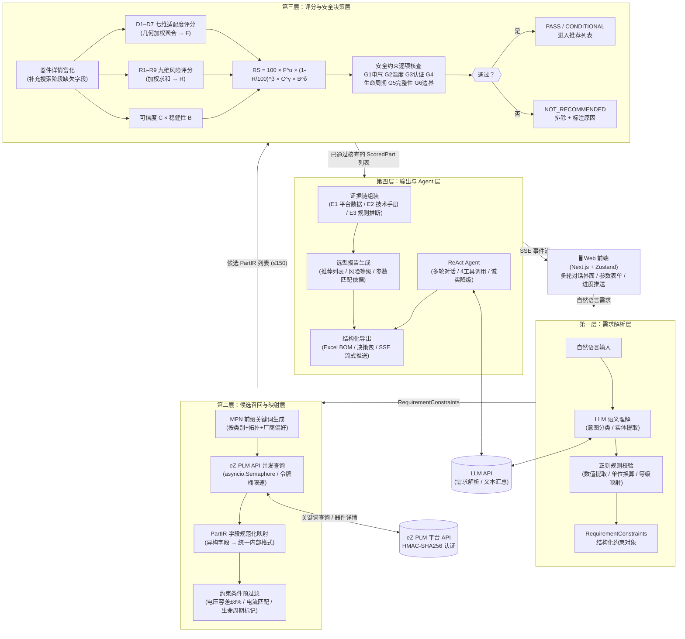
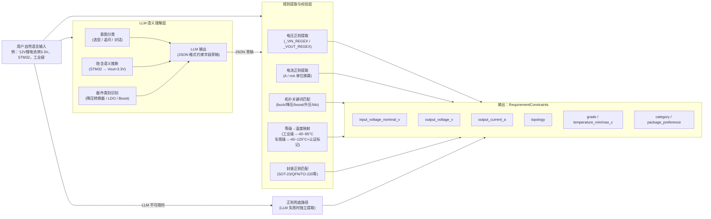
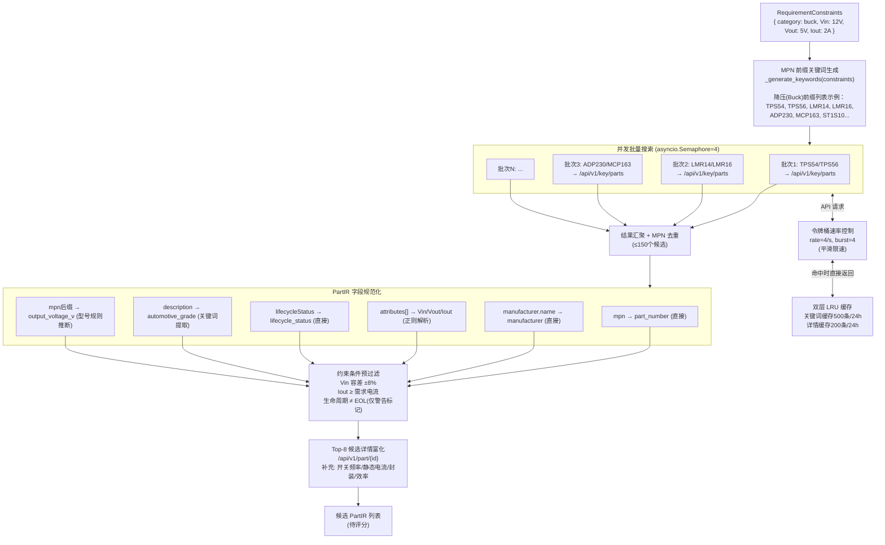
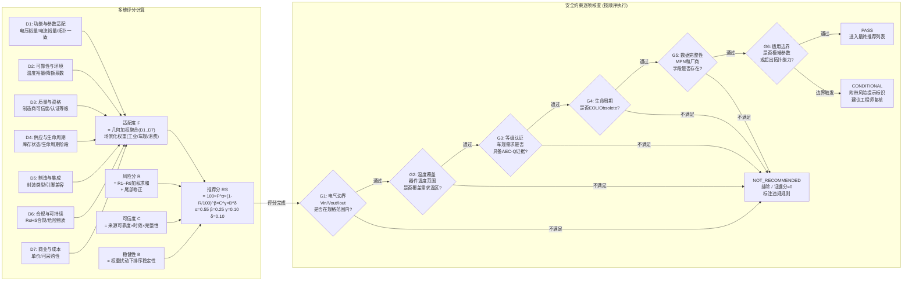
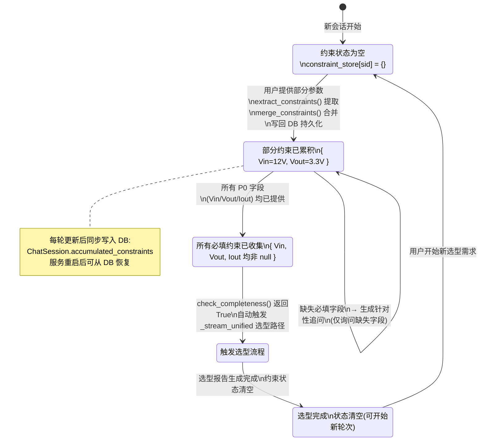
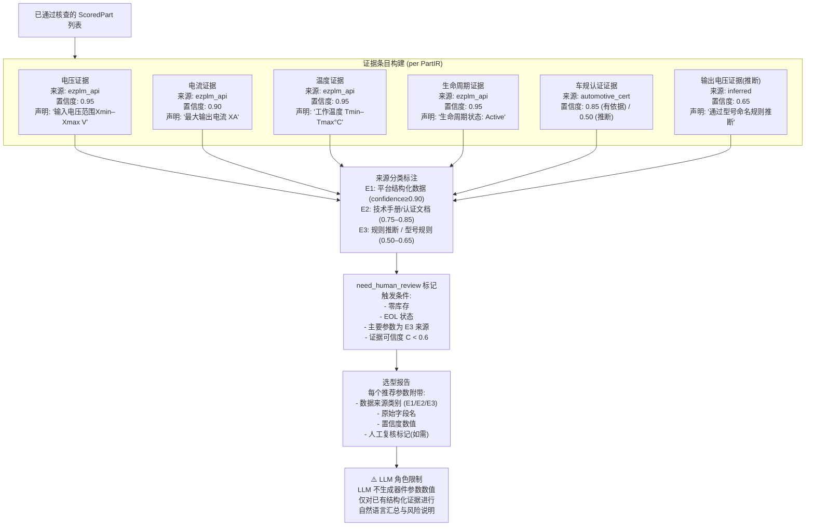

# eZmanbo 系统架构图生成指令

> 本文档提供 6 张核心架构图的 Mermaid 代码（可直接粘贴到 https://mermaid.live 渲染）及配套的 AI 图像生成提示词（适用于 Midjourney / DALL-E 等工具生成信息图风格示意图）。每张图均附有用于手绘/draw.io 制图的文字说明。

---

## 图1：系统总体四层架构

### Mermaid 代码



### 用于 draw.io / 手绘的文字说明

整体为纵向四层矩形区块，从上到下依次为：
- **第一层（蓝色）**：需求解析层，含 LLM 语义模块和正则规则模块两个并联子模块，输出 RequirementConstraints 方框
- **第二层（绿色）**：候选召回层，含关键词生成→并发 API 查询→字段规范化→预过滤四个顺序步骤，右侧标注 eZ-PLM API 圆柱
- **第三层（橙色）**：评分与决策层，评分子模块（D1-D7 / R1-R9 / C / B → RS 公式）后接六条规则的菱形判断框，分叉为 PASS（进入）和 FAIL（排除）两个出口
- **第四层（紫色）**：输出层，含证据链组装、报告生成、ReAct Agent 三个模块，下方连接导出模块
- 左右两侧分别标注 LLM API（虚线连接第一层和Agent）和前端 Web（顶部箭头进入）

---

## 图2：自然语言约束解析模块



---

## 图3：候选召回与 PartIR 规范化流程



---

## 图4：评分计算与安全约束核查



---

## 图5：多轮对话约束累积状态机



---

## 图6：证据链生成与来源标注



---

## AI 图像生成提示词（视觉信息图风格）

以下提示词适用于 Midjourney、DALL-E 3 或 Stable Diffusion，生成适合演示文稿的视觉化架构示意图（非精确技术图，用于 PPT 配图）：

### 图1 总体架构（PPT 封面配图风格）
```
Technical architecture diagram of an AI-powered electronic component selection system, 
four-layer vertical pipeline design, clean white background with blue and teal color scheme, 
flat design style, professional engineering infographic. 
Layer 1: natural language parsing with LLM and rule extraction modules. 
Layer 2: parallel API query to component database with token bucket rate control. 
Layer 3: multi-dimensional scoring (D1-D7) feeding into sequential safety constraint checks. 
Layer 4: evidence chain assembly and report generation with ReAct agent. 
Data flows shown as clean arrows between layers. 
External services (LLM API, eZ-PLM database) shown as cylinders on the side. 
Font: Inter/Helvetica. Style: technical paper figure, IEEE format, high resolution.
```

### 图4 评分与安全核查流（PPT 流程图风格）
```
Clean technical flowchart showing a multi-dimensional scoring pipeline for electronic 
component selection, white background, professional blue and orange color scheme. 
Left side: seven scoring dimensions (D1 through D7) with individual score bars converging 
into a weighted geometric aggregation formula box. Center: multiplicative recommendation 
score formula with Greek letter exponents. Right side: sequential decision tree with six 
diamond-shaped check nodes (G1 electrical, G2 temperature, G3 certification, G4 lifecycle, 
G5 data completeness, G6 boundary), green PASS exit at bottom and red NOT_RECOMMENDED 
exits on the sides. Flat design, rounded rectangles, no shadows. IEEE paper figure style.
```

### 图5 多轮约束累积（状态机可视化）
```
State machine diagram for multi-turn conversation constraint accumulation, minimal design, 
light gray background with white state boxes. Four states: EMPTY (gray), PARTIAL (blue, 
showing accumulated constraints like Vin=12V Vout=3.3V as small tags), COMPLETE (green), 
SELECTION_TRIGGERED (orange). Transitions shown as labeled arrows: "extract + merge" from 
EMPTY to PARTIAL, "clarification question" self-loop on PARTIAL, "all P0 fields filled" 
from PARTIAL to COMPLETE, "auto-trigger pipeline" from COMPLETE to SELECTION. 
Bottom annotation: database icon with "DB persistence on every update". 
Clean sans-serif font, professional technical diagram.
```
