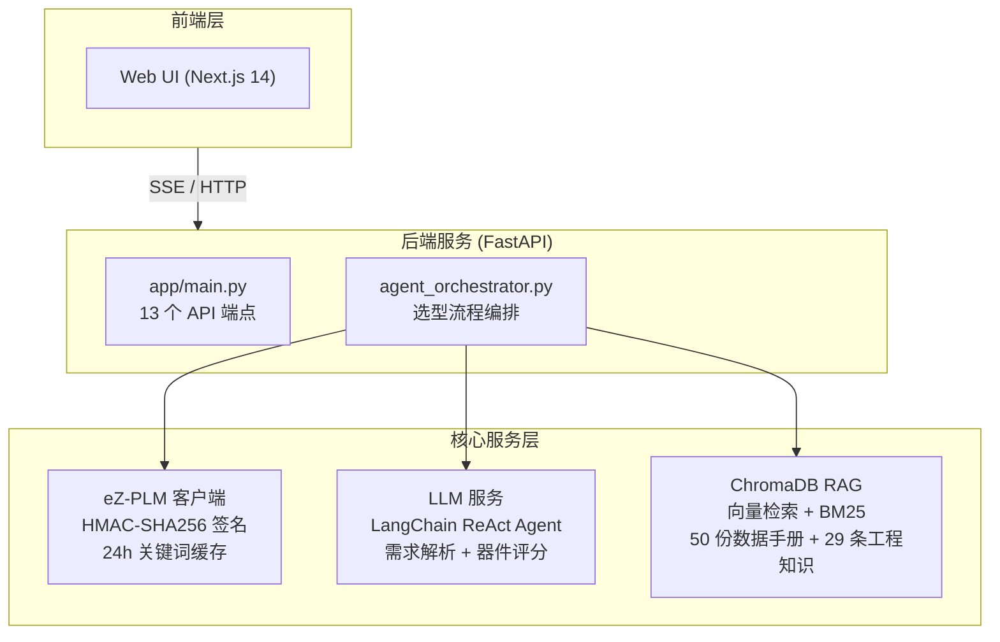

# eZmanbo 复现说明

## 目录

1. [摘要](#1-摘要)
2. [运行环境要求](#2-运行环境要求)
3. [环境搭建流程](#3-环境搭建流程)
4. [系统启动与验证](#4-系统启动与验证)
5. [实验评测方案](#5-实验评测方案)
6. [核心模块说明](#6-核心模块说明)
7. [评分模型与指标](#7-评分模型与指标)
8. [故障诊断与排查](#8-故障诊断与排查)
9. [复现成功判定标准](#9-复现成功判定标准)
10. [附录](#10-附录)

---

## 1. 摘要

eZmanbo 是面向电子元器件智能选型与供应链风险评估的 Agent 系统，深度集成 eZ-PLM 平台，支持 DataSheet RAG 检索。本复现方案提供从环境搭建、系统启动到完整实验评测的标准化流程，便于独立验证系统的核心能力与各项实验结果。

系统实验体系包含 10 个实验套件（Suite A–J），覆盖约束解析、评分排序、LLM 增强对比、Agent 对话、性能基准、证据链审计、端到端场景、差异化对照、模块消融及数据价值分析，共计 124 余条测试用例，输出 30 余份数据文件及 18 份详细报告。

| 指标项 | 结果 |
|---|---|
| 约束解析字段准确率 | 100%（7 个核心字段） |
| 评分引擎排序通过率 | 100%（15 条 × 4 版本） |
| 端到端场景通过率 | 100%（6 条场景） |
| Agent 工具调用准确率 | 100%（7 条对话） |
| 评测覆盖拓扑类型 | DC-DC Buck / Boost、LDO |
| 评测覆盖场景 | 车规级、工业级、消费级、国产优先、多参数组合、温度范围、低噪声、完整 BOM |

## 2. 运行环境要求

### 2.1 硬件配置

| 配置项 | 最低要求 | 推荐配置 |
|--------|----------|----------|
| 操作系统 | macOS 12+ / Ubuntu 20.04 LTS / WSL2 | macOS 14+ / Ubuntu 22.04 LTS |
| 内存 | 8 GB | 16 GB 及以上 |
| 磁盘空间 | 5 GB（含 Python 依赖、嵌入模型与知识库） | 10 GB 及以上 |
| 网络 | 首次运行需下载嵌入模型（约 80 MB）与数据手册（约 30 MB） | 稳定互联网连接 |

### 2.2 软件依赖

| 软件 | 版本要求 | 用途说明 |
|------|----------|----------|
| Python | 3.9 及以上（推荐 3.11） | 后端服务运行环境 |
| Node.js | 18 及以上（推荐 20 LTS） | Web 前端构建与运行 |
| npm | 9 及以上 | 前端依赖包管理 |
| Git | 2.30 及以上 | 源代码版本管理 |

**Python 核心依赖（`requirements.txt`）：**

| 依赖包 | 版本要求 | 用途 |
|--------|----------|------|
| `pydantic` | ≥ 2.9 | 数据模型定义与校验 |
| `fastapi` | ≥ 0.115 | Web API 框架 |
| `uvicorn[standard]` | ≥ 0.30 | ASGI 服务器 |
| `chromadb` | ≥ 0.4 | 向量数据库 |
| `sentence-transformers` | ≥ 2.2 | 文本嵌入模型 |
| `langchain` | ≥ 1.0 | LLM Agent 框架 |
| `langchain-openai` | ≥ 0.1 | OpenAI 兼容 LLM 接入 |
| `rank_bm25` | ≥ 0.2.2 | BM25 关键词检索 |
| `openpyxl` | ≥ 3.1 | Excel 导出 |
| `pymupdf` | ≥ 1.23 | PDF 数据手册解析 |
| `schemdraw` | ≥ 0.18 | 电路图生成 |
| `requests` | ≥ 2.31 | HTTP 客户端 |

### 2.3 外部服务依赖

| 服务 | 是否必需 | 说明 |
|------|:--------:|------|
| eZ-PLM API | 是 | 元器件数据库检索与详情查询，需申请 API 密钥 |
| LLM API（OpenAI / DeepSeek / Ollama） | 是 | ReAct Agent 推理、意图分类与器件评分 |
| HuggingFace Hub | 首次运行 | 自动下载 `all-MiniLM-L6-v2` 句子嵌入模型，后续使用本地缓存 |

### 2.4 离线运行限制

- 句子嵌入模型首次下载后缓存在 `~/.cache/huggingface/`，后续不再联网
- 工程知识库（29 条设计知识）构建后存储于本地 ChromaDB，可离线检索
- 数据手册灌入 ChromaDB 后可离线进行 RAG 检索
- eZ-PLM API 与 LLM API 为持久性外部依赖，无法以离线模式替代

---

## 3. 环境搭建流程

### 3.1 获取源代码

```bash
git clone https://github.com/Lucas-cs11/ezmanbo-agent.git
cd ezmanbo-agent
```

### 3.2 一键部署

项目根目录提供了自动化部署脚本，按序执行环境检测、虚拟环境创建、依赖安装、配置初始化和知识库构建：

```bash
chmod +x setup.sh && ./setup.sh
```

### 3.3 手动部署

若因环境差异导致自动脚本不可用，可按以下步骤手动完成。

#### A. 创建虚拟环境

```bash
python3 -m venv .venv
source .venv/bin/activate
```

#### B. 安装 Python 依赖

```bash
pip install --upgrade pip
pip install -r requirements.txt
```

如遇 protobuf 兼容性问题，请参见第 8.1 节。

#### C. 安装前端依赖

```bash
cd frontend/web
npm install
cd ../..
```

### 3.4 环境变量配置

```bash
cp .env.example .env
```

编辑 `.env` 文件，填写真实凭证：

```env
# eZ-PLM API（必需）
EZPLM_API_KEY=epk_xxxxxxxxxxxxxxxxxxxxxxxxxxxxxxxxxxxxxxxx
EZPLM_BASE_URL=https://www.ezplm.cn

# LLM 服务（必需，兼容 OpenAI / DeepSeek / Ollama）
OPENAI_API_KEY=sk-xxxxxxxx
OPENAI_BASE_URL=https://api.deepseek.com
OPENAI_MODEL=deepseek-chat

# 可选配置
CORS_ORIGINS=http://localhost:3000,http://localhost:8000
DATASHEET_DIR=./docs/datasheets
CHROMA_DB_PATH=./data/chroma_db
```

| 变量名 | 必填 | 说明 |
|--------|:----:|------|
| `EZPLM_API_KEY` | 是 | eZ-PLM 平台 API 密钥（`epk_` 前缀） |
| `EZPLM_BASE_URL` | 否 | eZ-PLM 服务地址，默认 `https://www.ezplm.cn` |
| `OPENAI_API_KEY` | 是 | LLM API 密钥 |
| `OPENAI_BASE_URL` | 否 | LLM API 基础地址 |
| `OPENAI_MODEL` | 否 | 模型名称，默认 `deepseek-chat` |

### 3.5 工程知识库构建

系统内置 29 条工程设计知识（涵盖 Buck / Boost / LDO 设计公式、热管理规范、EMI 标准等），存储于 `data/knowledge/engineering_knowledge.json`。

```bash
# 构建知识库（首次运行自动执行，也可手动触发）
PYTHONPATH=. python3 scripts/build_knowledge_base.py

# 重建知识库
PYTHONPATH=. python3 scripts/build_knowledge_base.py --rebuild

# 验证检索功能
PYTHONPATH=. python3 scripts/build_knowledge_base.py --query "12V转5V buck 电感选型"
```

### 3.6 数据手册下载与向量化

系统集成了 50 款器件的 PDF 数据手册注册表（来源涵盖 TI、ADI、Microchip、ST 四家原厂），通过全管线脚本完成下载、解析与向量库灌入。

**前置要求**：项目根目录需存在 `数据手册下载清单_eZPLM_RAG.xlsx` 文件。

```bash
# 全管线：下载 PDF → 文本解析与分块 → 灌入 ChromaDB
PYTHONPATH=. python3 scripts/ingest_datasheets.py

# 跳过下载（PDF 已就绪）
PYTHONPATH=. python3 scripts/ingest_datasheets.py --skip-dl

# 清空旧库后重新灌入
PYTHONPATH=. python3 scripts/ingest_datasheets.py --clear
```

**处理流程说明：**

| 阶段 | 工具 | 参数 |
|------|------|------|
| PDF 下载 | Python `requests` | 断点续传、自动重试 |
| 文本解析 | PyMuPDF (fitz) | 按 Electrical / Thermal / Layout 章节分块，目标 600 字符/块，100 字符重叠 |
| 向量灌入 | Sentence-Transformer + ChromaDB | 批次大小 64，首次预计产生 8,000 余条向量记录 |

---

## 4. 系统启动与验证

### 4.1 启动后端服务

```bash
source .venv/bin/activate
PYTHONPATH=. python3 -m uvicorn app.main:app --host 0.0.0.0 --port 8000
```

**常用启动参数：**

| 参数 | 用途 |
|------|------|
| `--reload` | 开发模式热重载 |
| `--workers 4` | 生产模式多进程 |
| `--log-level info` | 指定日志输出级别 |

### 4.2 启动前端界面

在新终端窗口中执行：

```bash
cd frontend/web
npm run dev
```

启动后访问 `http://localhost:3000`。前端通过 Next.js `rewrites` 配置将 `/api/*` 自动代理至后端 `http://127.0.0.1:8000`。

### 4.3 系统运行验证

依次执行以下验证命令，确认各核心端点正常响应：

```bash
# 1. 健康检查
curl http://localhost:8000/health
# 预期响应：{"status": "ok"}

# 2. 意图分类验证
curl -X POST http://localhost:8000/classify \
  -H "Content-Type: application/json" \
  -d '{"user_input": "12V转5V 3A buck芯片 工业级"}'
# 预期响应包含 intent 字段

# 3. Pipeline 选型验证
curl -X POST http://localhost:8000/analyze \
  -H "Content-Type: application/json" \
  -d '{"user_input": "12V转5V 3A 降压芯片 工业级"}'
# 预期响应为 JSON 格式的 SelectionReport

# 4. ReAct Agent 对话验证
curl -X POST http://localhost:8000/agent/chat \
  -H "Content-Type: application/json" \
  -d '{"user_input": "推荐一款12V转5V 3A的buck芯片"}'
# 预期响应包含 response、tool_calls、session_id
```

---

## 5. 实验评测方案

### 5.1 实验体系总览

实验体系由 10 个实验套件（Suite A–J）构成，从约束解析准确性、评分引擎排序能力、LLM 增强贡献、Agent 对话可靠性、系统性能基准、证据链审计、端到端场景完整性、差异化对照及模块消融等多个维度对系统进行全面评测。

| 套件 | 评测维度 | 用例数 | 产出文件 |
|:----:|----------|:------:|----------|
| **A** | 约束解析准确性 | 18 条 | `suite_a/eval_report.md` |
| **B** | 评分引擎排序 | 15 条 × 4 版本 | `suite_b/scoring_results_v2.csv` |
| **C** | LLM 增强对比 | 15 条 | `suite_c/scoring_results_rule_only.csv` |
| **D** | ReAct Agent 能力 | 7 条 | `suite_d/agent_results.csv` |
| **E** | 性能与缓存基准 | 11 场景 | `suite_e/perf_benchmark.csv` |
| **F** | 证据链统计 | 39 条评分 | `suite_f/evidence_statistics.csv` |
| **G** | 端到端场景 | 6 条 | `suite_g/e2e_results_v2.csv` + 18 份报告 |
| **H** | 差异化对照（eZmanbo vs LLM Only） | 15 条 | `suite_h/llm_only_results.csv` |
| **I** | 模块消融实验 | 10 条 × 4 版本 | `suite_i/ablation_summary.csv` |
| **J** | eZ-PLM 数据价值分析 | 19 指标 | `suite_j/ezplm_metrics.csv` |

所有实验结果数据位于 `results/` 目录，按套件分别组织；实验报告汇总于 `results/experiment_final_report.md`。

### 5.2 套件 A：约束解析准确性

**目标：** 验证系统对自然语言需求的字段级解析准确率。

**用例：** `tests/cases/dc_dc_cases.jsonl`（18 条）与 `tests/cases/ldo_cases.jsonl`（10 条），以 28 条基础用例覆盖 Buck 降压、Boost 升压、LDO 三类拓扑，输入涵盖车规级、工业级、消费级、国产优先、多参数组合及温度范围等场景。

**校验维度（7 项核心字段）：**

| 校验项 | 说明 |
|--------|------|
| `category` | 器件类别识别（dc_dc_converter / ldo） |
| `topology` | 拓扑类型识别（buck / boost / ldo） |
| `output_voltage_v` | 输出电压数值解析 |
| `output_current_a` | 输出电流数值解析 |
| `temperature_min_c` | 最低工作温度解析 |
| `temperature_max_c` | 最高工作温度解析 |
| `grade` | 应用等级识别（automotive / industrial / commercial） |

**执行命令：**

```bash
source .venv/bin/activate
PYTHONPATH=. python3 tests/eval_runner.py
```

### 5.3 套件 B：评分引擎排序

**目标：** 验证评分引擎对候选器件的排序合理性及门禁（Gate）机制的有效性。

**用例：** 15 条评分配置用例，覆盖 Buck（非车规 8 条、车规 2 条）、Boost（3 条）、LDO（2 条）四类场景，每条用例输出各候选器件的七维适配度评分（F-Score）、九维风险评分（R-Score）、可信度（C）、稳健性（B）及推荐等级。

**执行命令：**

```bash
source .venv/bin/activate
PYTHONPATH=. python3 experiments/run_suite_b.py
```

### 5.4 套件 C：LLM 增强对比

**目标：** 评估 LLM 增强对评分的实际影响程度。

**方法：** 在关闭 LLM 增强的纯规则模式下运行与套件 B 相同的 15 条用例，对比两组成绩差异。

**执行命令：**

```bash
source .venv/bin/activate
PYTHONPATH=. python3 experiments/run_suite_c.py
```

### 5.5 套件 D：ReAct Agent 能力

**目标：** 验证 ReAct Agent 在对话场景中的工具调用准确率与回答可靠性。

**用例：** 7 条对话场景，要求 Agent 调用 `search_components`、`query_design_knowledge`、`find_alternative_parts`、`generate_full_report` 四个工具完成用户需求。

**关键验证点：**
- 工具调用准确率：7/7（100%）
- 幻觉检测：在器件编号不存在（如 TPS99999）时应诚实回复"未找到"，而非虚构参数
- 多轮对话连续性：上下文应正确保持

**执行命令：**

```bash
source .venv/bin/activate
PYTHONPATH=. python3 experiments/run_suite_d.py
```

### 5.6 套件 E：性能与缓存基准

**目标：** 评测系统在不同缓存状态下的端到端延迟。

**场景定义：**

| 场景 | 说明 |
|:----:|------|
| 冷启动 | 首次查询，无任何缓存 |
| 热缓存（精确重复） | 完全相同的输入查询，语义缓存命中 |
| 语义相似 | 输入语义相似但非完全相同的查询 |

**执行命令：**

```bash
source .venv/bin/activate
PYTHONPATH=. python3 experiments/run_suite_e.py
```

### 5.7 套件 F：证据链统计

**目标：** 审计选型结果中各证据来源的分布比例。

**统计维度：** 证据得分均值与中位数、证据来源占比（eZ-PLM 结构化数据、数据手册、推断、LLM）。

**执行命令：**

```bash
source .venv/bin/activate
PYTHONPATH=. python3 experiments/run_suite_f.py
```

### 5.8 套件 G：端到端场景

**目标：** 在 6 个完整的工业场景中验证从需求录入到报告输出的全链路交付能力。

**场景清单：**

| 用例 | 场景描述 | 预期 Top-1 |
|:----:|----------|:----------:|
| G-001 | 12V→3.3V 车规 Buck | Gate 拦截 |
| G-002 | 24V→5V 车规 Buck | Gate 拦截 |
| G-003 | USB-C PD 降压（15W） | MCP16301T-E/CHY（60.6） |
| G-004 | 电池供电 Boost | TPS61240IDRVRQ1（73.66） |
| G-005 | 完整 BOM 导出 | TPS54020RUWR（72.37） |
| G-006 | 工业电源 Buck | 15 候选 |

每个场景输出三类报告：BOM 报告（29 列企业级 EBOM）、风险评估报告（L1–L5 风险等级）、拓扑分析报告（参数化电路图）。

**执行命令：**

```bash
source .venv/bin/activate
PYTHONPATH=. python3 experiments/run_suite_g.py
```

### 5.9 套件 H：差异化对照

**目标：** 对比 eZmanbo 全系统与纯 LLM 模式的选型输出质量和覆盖度。

**方法：** 在纯 LLM 模式下运行与套件 G 相同的 6 条端到端场景，对比两组的候选器件数量、评分维度、门禁检查、风险等级、证据链及报告输出能力。

**执行命令：**

```bash
source .venv/bin/activate
PYTHONPATH=. python3 experiments/run_suite_h.py
```

### 5.10 套件 I：模块消融实验

**目标：** 量化各核心模块（Gate 门禁、LLM 增强）对评分结果的独立贡献。

**实验设计：** 以 10 条代表性用例分别在四种模式下运行：
1. **Full** — 完整系统
2. **No Gate** — 跳过门禁检查
3. **No LLM** — 纯规则模式
4. **LLM Only** — 纯 LLM 模式

Gate 消融导致车规用例评分从 0 升至 54–57 分，说明门禁机制有效阻止了不满足 AEC-Q 要求的器件被推荐。

**执行命令：**

```bash
source .venv/bin/activate
PYTHONPATH=. python3 experiments/run_suite_i.py
```

### 5.11 套件 J：eZ-PLM 数据价值分析

**目标：** 量化 eZ-PLM 结构化数据对选型结果的贡献。

**统计维度：** 候选器件召回率（12.9/条）、核心字段填充率（Vin/Vout/Iout 均为 100%）、证据来源中 eZ-PLM 占比（83.3%）、幻觉抑制率（100%，LLM Only 为 92.3%）。

**执行命令：**

```bash
source .venv/bin/activate
PYTHONPATH=. python3 experiments/run_suite_j.py
```

### 5.12 全部实验一键执行

```bash
source .venv/bin/activate

# 按顺序执行全部 10 个套件
PYTHONPATH=. python3 experiments/run_all_suites.py
```

### 5.13 实验结果汇总

全部实验结果汇总于 `results/experiment_final_report.md`，包含：
- 各套件通过率汇总表
- 核心发现（Gate 门禁影响、Buck 评分稳定性、LLM 增强场景特定性、缓存加速比、Agent 工具准确率）
- 各套件详细结果与数据表格

可视化图表位于 `figures/` 目录，涵盖：字段准确率柱状图、Gate 拦截效果图、Buck 评分一致性图、消融影响柱状图、端到端场景案例矩阵、ECDF 延迟分布图、候选数量分布图、证据来源分布图、风险等级分布图。

---

## 6. 核心模块说明

### 6.1 系统架构



### 6.2 核心模块功能总览

| 模块 | 功能描述 | 关键参数 |
|------|----------|----------|
| `app/main.py` | FastAPI 应用入口，注册 13 个 API 端点，管理 CORS 与会话 | `--host`, `--port`, `--workers` |
| `app/agent_orchestrator.py` | 选型流水线编排，串联需求解析、器件检索、评分、证据链、风险评估与报告生成 | — |
| `app/constraint_checker.py` | 约束参数提取（正则规则），按 P0 / P1 / P2 三级进行完整性校验与渐进式追问 | P0: Vin / Vout / Iout; P1: 温度 / 等级; P2: 封装 / 场景 |
| `app/requirement_parser.py` | 自然语言需求解析，输出结构化 `RequirementConstraints` | 输入文本 |
| `app/intent_classifier.py` | 三层意图分类（选型 / 对话 / 调整 / 追问），LLM 与规则混合决策 | `has_active_selection` |
| `app/scoring.py` | 评分引擎：七维适配度 + 九维风险 + 可信度 + 稳健性 + 国产加分 | 按工业 / 车规 / 消费动态分配权重 |
| `app/ezplm_client.py` | eZ-PLM API 客户端，HMAC-SHA256 签名认证，24h 关键词缓存 | `EZPLM_API_KEY` |
| `app/react_agent.py` | LangChain ReAct Agent，4 工具编排，会话隔离与持久化 | `thinking_depth`（四级可配） |
| `app/agent_tools.py` | Agent 工具集：器件搜索 / 知识查询 / 替代查找 / 报告生成 | 搜索重试上限 = 2 |
| `app/rag.py` | ChromaDB 工程知识库，Sentence-Transformer 嵌入 + 语义检索 | `top_k=5` |
| `app/datasheet_rag.py` | 50 器件数据手册注册表 + 本地文件访问 + 可信度增强 | 内置注册表 |
| `app/datasheet_parser.py` | PDF 文本提取与章节分块（PyMuPDF） | `target_chunk_size=600`, `chunk_overlap=100` |
| `app/hybrid_retrieval.py` | BM25 + 向量检索 RRF 融合 | `bm25_weight=0.5`, `rrf_k=60` |
| `app/semantic_cache.py` | 语义相似度缓存（相似度 > 0.95 命中） | `all-MiniLM-L6-v2` |
| `app/evidence.py` | 证据链构建：参数符合性声明 + 置信度评估 | — |
| `app/report_generator.py` | 选型报告组装与风险评估 | — |
| `app/output_generator.py` | 三类报告生成（BOM / 风险 / 拓扑） | `report_type` |
| `app/output_bom.py` | BOM Excel 导出，29 列企业级 EBOM，三 Sheet | — |
| `app/schematic_generator.py` | 参数化 SVG 电路图（Buck / Boost / LDO） | `topology`, `Vin`, `Vout`, `Iout` |
| `app/schemas.py` | Pydantic 数据模型（`PartIR`、`RequirementConstraints` 等） | Pydantic 2.x |
| `app/thinking.py` | 思考深度控制器（temperature + prompt + max_tokens） | `thinking_depth` |
| `app/memory.py` | 用户记忆系统（称呼、选型历史记录） | — |

### 6.3 ReAct Agent 工具集

| 工具 | 功能 | 调用限制 |
|------|------|----------|
| `search_components` | 检索元器件数据库 | 每需求最多 2 次 |
| `query_design_knowledge` | 检索工程知识库 | 每对话最多 1 次 |
| `find_alternative_parts` | 查找替代器件（含国产替代） | 仅在用户明确要求时调用 |
| `generate_full_report` | 生成完整 BOM + 风险 + 拓扑报告 | 选型确认后调用 1 次 |

### 6.4 思考深度参数

| 级别 | temperature | max_tokens | 效果说明 |
|------|:-----------:|:----------:|----------|
| off | 0.0 | 1024 | 不暴露思考过程，响应最快 |
| default | 0.3 | 2048 | 展示基本思考过程，适用于日常使用 |
| contemplation | 0.5 | 3072 | 展示工具调用链与评分依据 |
| exhaustive | 0.7 | 4096 | 完整推理过程，适用于调试分析 |

---

## 7. 评分模型与指标

### 7.1 七维适配度权重（F-Score）

评分引擎根据应用场景（工业 / 车规 / 消费）动态调整各维度系数：

| 维度 | 工业 / 通用 | 车规 | 消费类 |
|------|:-----------:|:----:|:------:|
| D1 功能与参数适配 | 0.25 | 0.22 | 0.25 |
| D2 可靠性与环境 | 0.15 | **0.22** | 0.10 |
| D3 质量与资格 | 0.10 | **0.18** | 0.08 |
| D4 供应与生命周期 | **0.20** | 0.15 | 0.15 |
| D5 制造与集成 | 0.10 | 0.10 | 0.10 |
| D6 合规与可持续 | 0.10 | 0.08 | 0.07 |
| D7 商业与成本 | 0.10 | 0.05 | **0.25** |

### 7.2 推荐等级划分

推荐分 RS 由七维适配度（F）、九维风险（R）、可信度（C）、稳健性（B）按场景加权计算：

```
RS = α · F − β · R + γ · C + δ · B
```

| 等级 | RS 阈值 | R 上限 | C 下限 | 推荐标签 |
|:----:|:-------:|:------:|:------:|----------|
| A 优先推荐 | ≥ 85 | ≤ 20 | ≥ 80 | recommended |
| B 推荐 | ≥ 75 | ≤ 35 | ≥ 65 | recommended |
| C 条件推荐 | ≥ 65 或 Gate Conditional | — | — | conditionally_recommended |
| D 不优先推荐 | ≥ 50 | — | — | conditionally_recommended |
| E 禁止推荐 | Gate Fail | — | — | not_recommended |

### 7.3 门禁检查

系统在评分前执行 6 项硬性门禁检查，任一失败即触发降级或拒绝：

| 门禁 | 检查项 |
|:----:|--------|
| G1 | 电气边界：输出电流不足或输入电压不覆盖标称值 |
| G2 | 温度边界：工作温度范围不满足需求 |
| G3 | 生命周期：Obsolete / EOL 新设计禁用，NRND 条件告警 |
| G4 | 车规资格：项目要求 AEC-Q 认证但器件未通过 |
| G5 | 数据底线：MPN 或制造商字段缺失 |
| G6 | 输出电流合理性：Iout > 100A 判定为异常数据并标记为不可用 |

### 7.4 推荐分指数组合

| 场景 | α (F) | β (R) | γ (C) | δ (B) | 国产加成 |
|------|:-----:|:-----:|:-----:|:-----:|:--------:|
| 工业 | 0.55 | 0.25 | 0.10 | 0.10 | +4% |
| 车规 | 0.45 | 0.35 | 0.10 | 0.10 | +3% |
| 消费 | 0.60 | 0.20 | 0.10 | 0.10 | +5% |

---

## 8. 故障诊断与排查

### 8.1 Protobuf 兼容性问题

**现象：** `TypeError: Descriptors cannot be created directly` 或 protobuf 版本冲突。

**解决方案：**

```bash
# 方案 A：安装兼容版本的 protobuf
pip install protobuf==3.20.3

# 方案 B：设置 Python 实现模式
export PROTOCOL_BUFFERS_PYTHON_IMPLEMENTATION=python

# 方案 C：升级 chromadb（≥ 0.4.22 已修复）
pip install --upgrade chromadb
```

### 8.2 ChromaDB 初始化异常

**现象：** `sqlite3.OperationalError: no such table` 或 ChromaDB 加载失败。

**解决方案：**

```bash
# 清空并重建知识库
rm -rf data/chroma_db
PYTHONPATH=. python3 scripts/build_knowledge_base.py

# 检查磁盘空间与文件权限
df -h data/
chmod -R 755 data/chroma_db/
```

### 8.3 LLM 服务连接异常

**现象：** `RuntimeError: OPENAI_API_KEY 未设置` 或 API 请求超时。

**诊断步骤：**

```bash
# 1. 验证 .env 配置
cat .env | grep -E '(OPENAI|EZPLM)'

# 2. 测试 LLM API 连通性
curl -H "Authorization: Bearer $OPENAI_API_KEY" "$OPENAI_BASE_URL/models"

# 3. 测试 eZ-PLM API 连通性
curl -H "X-API-Key: $EZPLM_API_KEY" "$EZPLM_BASE_URL/api/v1/api-key/parts?keyword=buck"
```

### 8.4 嵌入模型下载失败

**现象：** `OSError: all-MiniLM-L6-v2 is not a local folder` 或 HuggingFace 连接超时。

```bash
# 手动触发下载
python3 -c "from sentence_transformers import SentenceTransformer; SentenceTransformer('all-MiniLM-L6-v2')"

# 使用 HuggingFace 镜像
export HF_ENDPOINT=https://hf-mirror.com
```

### 8.5 前端端口冲突

**现象：** `Error: listen EADDRINUSE :::3000`。

```bash
# 使用备用端口
cd frontend/web && npm run dev -- -p 3001

# 同步更新 CORS 配置：CORS_ORIGINS=http://localhost:3001,http://localhost:8000
```

### 8.6 eZ-PLM API 速率限制

**现象：** HTTP 429 Too Many Requests。

系统内置 24 小时内存缓存，首次查询执行全量拉取后，相同关键词在 24 小时内命中缓存。若频繁触发限流，可增大请求间隔：

```bash
# 编辑 app/ezplm_client.py 中 _API_DELAY_S，建议调至 0.5–1.0 秒
```

---

## 9. 复现成功判定标准

以下全部条件满足时，认定复现成功：

### 9.1 基础服务验证

| 编号 | 验证项 | 判定标准 |
|:----:|--------|----------|
| 1 | 后端健康检查 | `curl http://localhost:8000/health` 返回 `{"status": "ok"}` |
| 2 | 意图分类正常 | `POST /classify` 正确返回意图标签 |
| 3 | 流式选型正常 | `POST /analyze/stream` 推送完整的 7 阶段 SSE 事件流 |
| 4 | Agent 对话正常 | `POST /agent/chat` 返回合理的对话回复 |
| 5 | 前端可访问 | `http://localhost:3000` 正常加载并可调用后端接口 |

### 9.2 实验套件验证

| 编号 | 验证项 | 判定标准 |
|:----:|--------|----------|
| 6 | Suite A 约束解析 | 28 条用例全部通过，字段解析准确率 100% |
| 7 | Suite B 评分排序 | 15 条评分配置运行完毕，输出评分明细 CSV |
| 8 | Suite C LLM 对比 | 纯规则模式运行完毕，与 Baseline 对比分析可用 |
| 9 | Suite D Agent 能力 | 7 条对话测试全部通过，工具调用准确率 100% |
| 10 | Suite E 性能基准 | 冷启动 / 热缓存 / 语义相似三场景延迟数据完整 |
| 11 | Suite F 证据链审计 | 证据来源分布统计数据可用 |
| 12 | Suite G 端到端场景 | 6 条场景全部通过，输出 18 份三类报告 |
| 13 | Suite H 差异化对照 | LLM Only 模式运行完毕，对比分析可用 |
| 14 | Suite I 模块消融 | Full / No Gate / No LLM / LLM Only 四版本数据完整 |
| 15 | Suite J 数据价值 | eZ-PLM 数据贡献指标统计可用 |

**Pipeline 选型输出示例（`POST /analyze`）：**

```json
{
  "request_id": "uuid-string",
  "user_input": "12V转5V 3A 降压芯片",
  "constraints": {
    "category": "dc_dc_converter",
    "topology": "buck",
    "input_voltage_nominal_v": 12.0,
    "output_voltage_v": 5.0,
    "output_current_a": 3.0
  },
  "candidates": [
    {
      "part": {
        "part_number": "TPS54360",
        "manufacturer": "Texas Instruments"
      },
      "score": {
        "total_score": 78.5,
        "parameter_match_score": 85.0,
        "supply_risk_score": 80.0
      },
      "rank": 1,
      "recommendation_level": "recommended"
    }
  ],
  "risks": {
    "overall_risk_level": "medium"
  }
}
```

**SSE 流式事件序列（`POST /analyze/stream`）：**

```
cache_hit → parse_done → search_done → score_update (×N)
→ evidence_done → risk_done → text_delta (×N) → done
```

---

## 10. 附录

### A. 项目目录结构

```
ezmanbo-agent/
├── app/                          # 后端核心模块（23 个）
│   ├── main.py                   # FastAPI 应用入口
│   ├── constraint_checker.py     # 约束校验与追问
│   ├── scoring.py                # 评分引擎
│   ├── react_agent.py            # ReAct Agent
│   ├── agent_tools.py            # Agent 工具定义
│   ├── rag.py                    # ChromaDB 知识库
│   ├── datasheet_rag.py          # 数据手册 RAG
│   ├── ezplm_client.py           # eZ-PLM API 客户端
│   ├── schemas.py                # 数据模型定义
│   └── ...
│
├── frontend/web/                 # Next.js 14 前端
│   ├── src/components/           # React 组件
│   ├── src/store/                # Zustand 状态管理
│   └── public/                   # 静态资源
│
├── scripts/
│   ├── build_knowledge_base.py   # 工程知识库构建
│   ├── download_datasheets.py    # 数据手册下载
│   └── ingest_datasheets.py      # 全管线数据手册灌入
│
├── tests/
│   ├── cases/                    # 评测用例（JSONL）
│   └── eval_runner.py            # 评测运行脚本
│
├── experiments/                  # 实验套件脚本
│   ├── run_suite_a.py            # Suite A：约束解析
│   ├── run_suite_b.py            # Suite B：评分排序
│   ├── run_suite_c.py            # Suite C：LLM 对比
│   ├── run_suite_d.py            # Suite D：Agent 能力
│   ├── run_suite_e.py            # Suite E：性能基准
│   ├── run_suite_f.py            # Suite F：证据链审计
│   ├── run_suite_g.py            # Suite G：端到端场景
│   ├── run_suite_h.py            # Suite H：差异化对照
│   ├── run_suite_i.py            # Suite I：模块消融
│   ├── run_suite_j.py            # Suite J：数据价值
│   └── run_all_suites.py         # 全部套件一键执行
│
├── results/                      # 实验结果数据
│   ├── suite_a/                  # Suite A 输出
│   ├── suite_b/                  # Suite B 输出
│   ├── suite_c/                  # Suite C 输出
│   ├── suite_d/                  # Suite D 输出
│   ├── suite_e/                  # Suite E 输出
│   ├── suite_f/                  # Suite F 输出
│   ├── suite_g/                  # Suite G 输出 + 18 份报告
│   ├── suite_h/                  # Suite H 输出
│   ├── suite_i/                  # Suite I 输出
│   ├── suite_j/                  # Suite J 输出
│   └── experiment_final_report.md # 实验总报告
│
├── figures/                      # 可视化图表（PDF）
│
├── data/
│   ├── knowledge/                # 工程知识 JSON
│   └── chroma_db/                # 向量数据库
│
├── .env.example                  # 环境变量模板
├── requirements.txt              # Python 依赖清单
├── setup.sh                      # 一键部署脚本
└── README.md                     # 项目说明文档
```

### B. API 端点清单

| 方法 | 端点 | 功能说明 |
|------|------|----------|
| GET | `/health` | 服务健康检查 |
| POST | `/analyze` | Pipeline 选型分析（同步） |
| POST | `/analyze/stream` | 流式选型分析（SSE） |
| POST | `/classify` | 用户意图分类 |
| POST | `/agent/chat` | Agent 单轮对话 |
| POST | `/agent/chat/stream` | Agent 流式对话 |
| GET | `/agent/sessions` | 查询活跃会话列表 |
| POST | `/agent/init_session` | 创建或注入会话上下文 |
| POST | `/replacement` | 替代器件检索 |
| GET | `/schematic/{topology}` | 参数化电路图（SVG） |
| GET | `/report/{type}` | 三类报告 Markdown 输出 |
| POST | `/upload/parse` | 文件上传与需求解析 |
| POST | `/export/bom` | BOM Excel 导出 |

### C. 评分标准参考文献

eZmanbo 评分模型参照以下国际标准与研究报告：

- ISO 31000:2018 — Risk Management Guidelines
- IEC 31010:2019 — Risk Assessment Techniques
- IEC 60812:2018 — Failure Modes and Effects Analysis (FMEA)
- IEC 62402:2019 — Obsolescence Management
- OECD/JRC — Handbook on Constructing Composite Indicators (2008)
